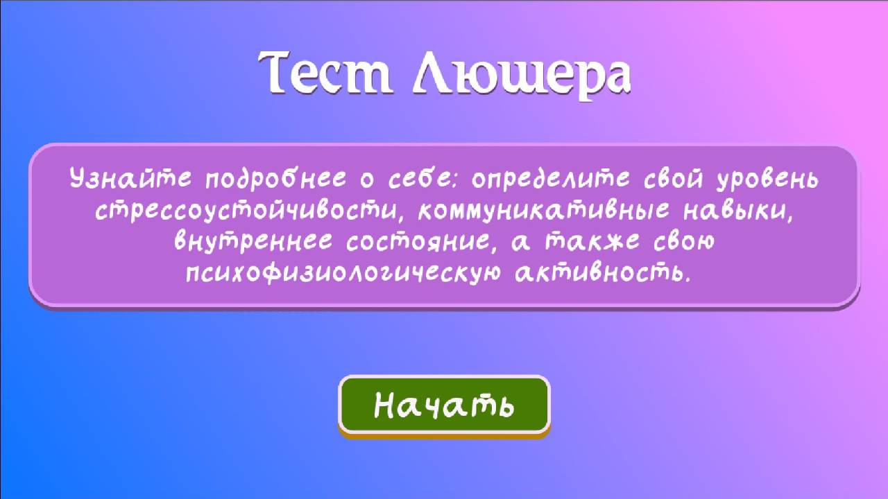

Тест Люшера используется для определения уровня стрессоустойчивости, коммуникативных навыков, психологического и физического состояния человека, а также наличия и причин стресса. 
Это один из наиболее популярных психологических тестов, используемых для диагностики внутреннего состояния человека. Тест Люшера основан на предположении о том, что выбор цвета отражает 
нередко направленность испытуемого на определенную деятельность, настроение, функциональное состояние и наиболее устойчивые черты личности.

Выполнен в gogot 3.5.

The Luscher test is used to determine the level of stress resistance, communication skills, psychological and physical state of a person, as well as the presence and causes of stress. 
This is one of the most popular psychological tests used to diagnose a person's internal state.

The Luscher test is based on the assumption that the choice of color often reflects the direction subject to a certain activity, mood, functional state and most stable personality traits.

Made in gogot 3.5

